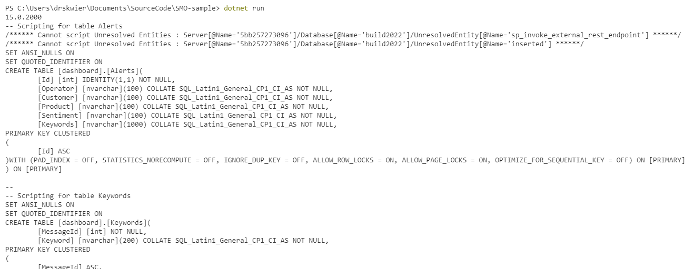

# SQL Management Objects (SMO) starter app

This is a sample app that shows how to use the [SQL Management Objects (SMO)](https://github.com/microsoft/sqlmanagementobjects) library to access APIs for managing and scripting SQL (SQL Server and Azure SQL).

- connects to a local SQL instance
- scripts the tables in a specific database

## More information about SQL Management Objects (SMO) available in:
- the source code at https://github.com/microsoft/sqlmanagementobjects
- the documentation at https://docs.microsoft.com/sql/relational-databases/server-management-objects-smo/overview-smo

## Start from this sample

### Prerequisites
1. The sample targets .NET 6.  Check that you have dotnet 6 installed with `dotnet --list-sdks`.
2. The sample requires an available SQL instance (SQL Server or Azure SQL). Update the sample code to match your available test environment.

## Use the sample
1. Clone the repository to your local machine
2. Run `dotnet restore` to restore the dependencies, including SMO
3. Run `dotnet build` to check that everything compiles
4. Run `dotnet run` to run the sample